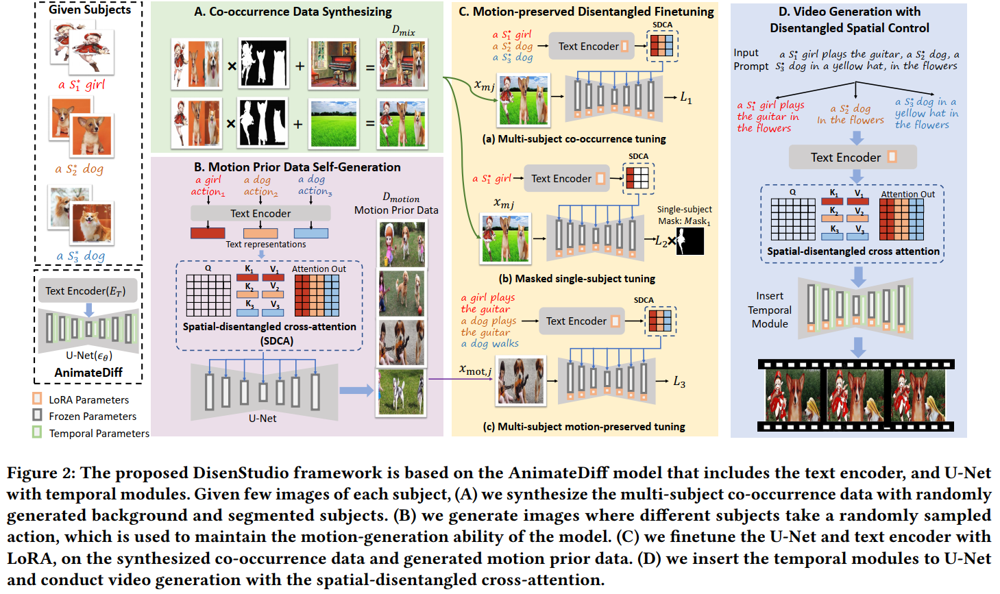

# DisenStudio 
> <a href="https://mn.cs.tsinghua.edu.cn/xinwang/PDF/papers/2024_DisenStudio%20Customized%20Multi-Subject%20Text-to-Video%20Generation%20with%20Disentangled%20Spatial%20Control.pdf">**DisenStudio: Customized Multi-Subject Text-to-Video Generation
with Disentangled Spatial Control**</a>
>
> Hong Chen, Xin Wang, Yipeng Zhang, Yuwei Zhou, Zeyang Zhang, Siao Tang, Wenwu Zhu


## Introduction
This repository is for our work **DisenStudio: Customized Multi-subject Text-to-Video Generation with Disentangled Spatial Control**. Our work aims to generate videos for the user-customized multiple subjects, according to the user-provided text descriptions, which enables controlling the location of each subject and supports different subjects to take different actions. The DisenStudio framework is shown in the following figure. More generated examples are given in the project page [DisenStudio](https://forchchch.github.io/disenstudio.github.io/).




# Installation
Install the conda virtual environment:
```bash
pip install diffusers(0.23.1)
pip install open_clip_torch
pip install torchvision
```

# Usage

## Customization
To customize the stable diffusion model with new subjects, first organize your own data as given in the "data" folder, you should add the instances, and the instance_mask. Then update the benchmark.json with the data you want to customize. After getting the data ready, please go into the "training" folder run the following script:

```bash
CUDA_VISIBLE_DEVICES=X python train_manager.py
```
After training, the checkpoints will be saved in the "training_results" folder.
## Generation
To generate new videos with your customized models. Please go into the "generation" folder and run the following code:

```bash
CUDA_VISIBLE_DEVICES=X python inference.py
```

Change the lora path in inference.py so that you can use different cutomized models.


## Citation
If you find our work useful, please kindly cite our work:
```bibtex
@article{chen2024disenstudio,
  title={DisenStudio: Customized Multi-subject Text-to-Video Generation with Disentangled Spatial Control},
  author={Chen, Hong and Wang, Xin and Zhang, Yipeng and Zhou, Yuwei and Zhang, Zeyang and Tang, Siao and Zhu, Wenwu},
  journal={arXiv preprint arXiv:2405.12796},
  year={2024}
}
```
